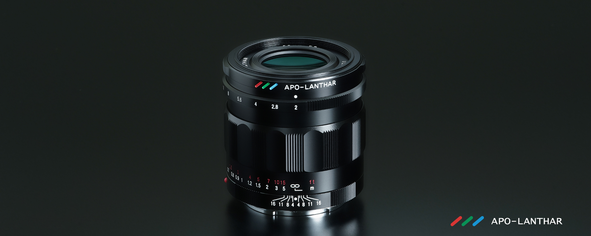
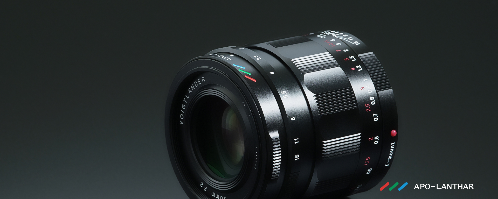

采用消色差设计，可将构成光的三原色RGB的轴上色差尽可能地减少至接近零。该镜头凝聚了确善能（Cosina）创业60年以及福伦达（Voigtländer）镜头发售20年来所积累的技术，追求极致性能。它兼具福伦达史上最佳标准镜头的性能，以及紧凑且易于操作的特点。

**兼容索尼E卡口**

搭载电子触点，拍摄数据的Exif信息可反映镜头使用情况。此外，由于内置了距离编码器，因此可与相机机身的五轴防抖功能配合使用。通过操作对焦环，还能实现取景器的放大显示等功能。

**优化光学设计**

在确保全画幅成像圈的同时，采用了针对索尼E卡口传感器优化的光学设计。画面边缘部分也能保持高分辨率，并抑制了色差等现象。

**复消色差设计**

为适应当前高像素的数字传感器，彻底抑制了轴向色差和倍率色差。

**可呈现圆形光斑的12片光圈叶片**

光圈叶片采用特殊形状，不仅在最大光圈F2时，在F2.8时也能呈现圆形。可利用点光源等创作出“圆形光斑”效果的作品。

**可实现精准对焦的手动对焦**

采用高精度加工和调整的全金属制螺旋槽单元，以及产生适度扭矩的高品质润滑脂，实现了顺滑的对焦操作感。可进行细微的对焦调整。

**光圈点击切换机构**

通过光圈点击切换机构，可无声地无级开闭光圈环。因此，在拍摄视频时无需担心会录入光圈环的操作音，同时还可通过光圈环的微调实现精准的景深控制。

### 拍摄样例

### PDF SPEC
you can [get the PDF](../../assets/pdf/ZEISS_LensNames.pdf) directly.
